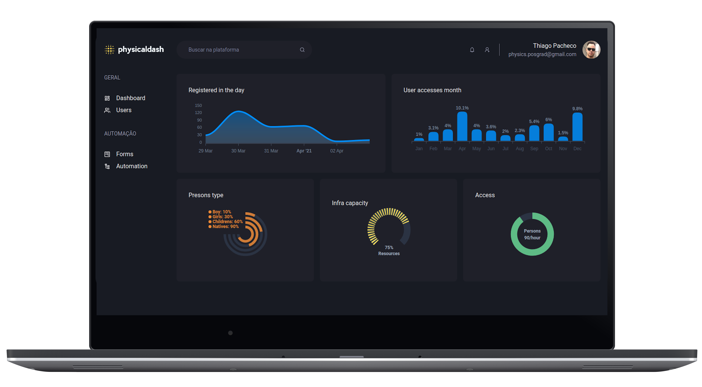
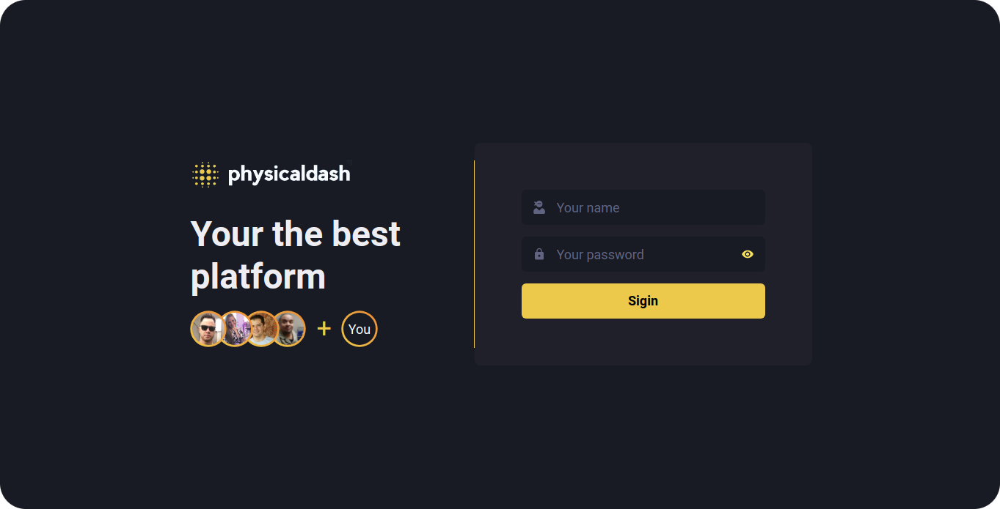
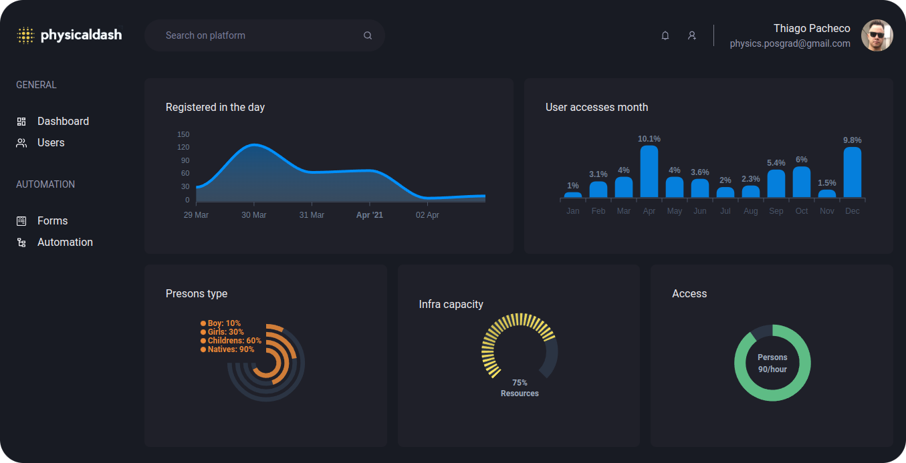
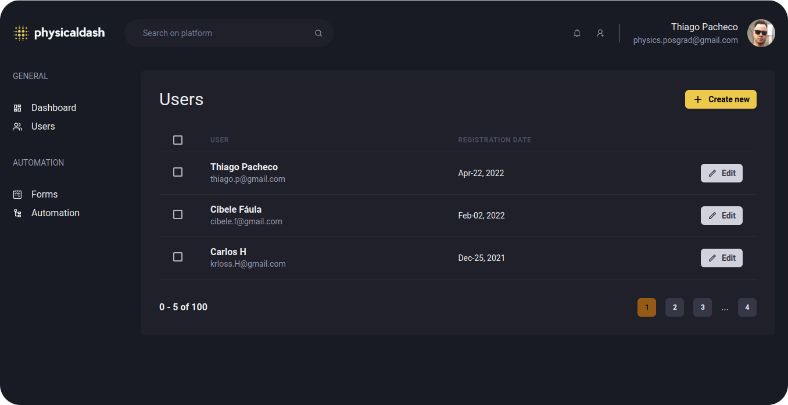
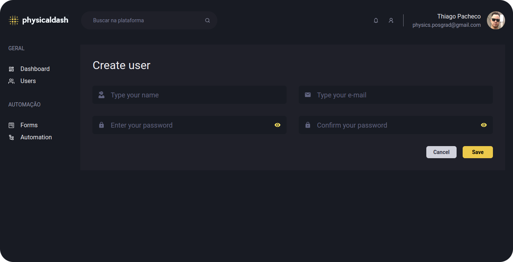

<div
  align="center"
  style="
    background: #29292e;
    border-radius: 1.5rem;
    display: flex;
    alight-itens:center;
    justify-content: center;
    flex-direction: column;
    padding: 10px 60px;
    margin: 10px 20px;
    border: 2px solid #444444;
  ">

  <h1 align="center">
      
  </h1>


  [](LICENSE.md)  
  
  
  


</div>

---

## **💻 Projeto**

<p align="center">
  
</p>

 Physicaldash é uma plataforma de controle de usuários com tela de dashboards criado com [Next.Js](https://nextjs.org/) e o [Chakra UI](https://chakra-ui.com/).

---

## **🔖 Layout**

Usamos como inspiração um projeto do pessoal da [Rocketseat](https://www.rocketseat.com.br/) que foi realizado em um de seus bootcamps. [Aqui](https://www.figma.com/file/av5oayZQ7CxXZkHkk5cAk4/Ignite-Dashgo-Copy?node-id=0%3A1) está layout no figma.

#### **App**

  <div>
    
    <br/>
    <br/>
    
    <br/>
    <br/>
    
    <br/>
    <br/>
    
  <div>

---

## **💻 Tecnologias**

  - **[Typescript][typescript]**
  - **[Next.js][next]**
  - **[Chakra UI][chakraui]**
  - **[Apex Charts][apexcharts]**
  - **[Axios][axios]**

##  **🚀 Start**

```bash
yarn && yarn dev
```


## **📚 Referências**

- [ReactJS][react_doc]
- [Next.js][next]
- [Node.js][node]


## **👨‍🚀 Autor**

 <a href="https://github.com/tpaphysics">

  <br />
  <sub>
    <b>Thiago Pacheco de Andrade</b>
  </sub>
</a>
<br />


👋 Meus contatos!

[](https://www.linkedin.com/in/thiago-pacheco-200a1a86/)
[](mailto:physics.posgrad.@gmail.com)


## **📝 Licença**

Veja o [arquivo](LICENSE.md) para mais detalhes.


<!-- Badges -->

[web_react_badge]: https://img.shields.io/badge/web-react-blue

[typescript_shields]: https://img.shields.io/badge/types-Typescript-blue

[next_shields]: https://img.shields.io/badge/vercel-Next.js-lightgrey


<!-- Techs -->

[react]: https://reactjs.org/

[react_doc]: https://reactjs.org/docs/getting-started.html

[react_doc_ptbr]: https://pt-br.reactjs.org/docs/getting-started.html

[node]: https://nodejs.org/en/

[vscode]: https://code.visualstudio.com/

[next_auth]: https://next-auth.js.org

[apexcharts]: https://apexcharts.com

[faunadb]: https://fauna.com

[github_oauth]: https://docs.github.com/pt/developers/apps/authorizing-oauth-apps

[next]: https://nextjs.org/

[typescript]: https://www.typescriptlang.org/

[chakraui]: https://chakra-ui.com

[miragejs]: https://miragejs.com

[axios]: https://github.com/axios/axios

[asdf]: https://github.com/asdf-vm/asdf

[yarn]: https://classic.yarnpkg.com/en/docs/install/#debian-stable

[stackedit]: https://stackedit.io

[markdown_emoji]: https://gist.github.com/rxaviers/7360908

[markdown-badges]: https://github.com/Ileriayo/markdown-badges/blob/master/README.md


